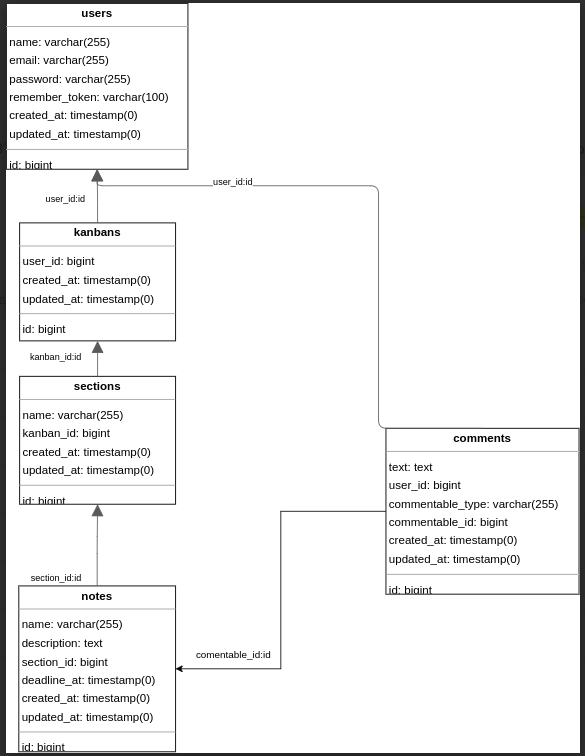

# Kanban

# Getting started

## Installation

    git clone git@github.com:mikloukho/rest-kanban.git

Switch to the repo folder

    cd rest-kanban

Copy the example env file and make the required configuration changes in the .env file

    cp .env.example .env

Build docker without cache

    docker compose build --no-cache

Up docker daemon

    docker compose up -d

Enter to docker container or use sail https://laravel.com/docs/10.x/sail
    
    docker compose exec laravel.test bash

Install composer dependency

    composer install

Generate a new application key

    php artisan key:generate

Generate a new JWT authentication secret key

    php artisan jwt:secret

Run the database migrations

    php artisan migrate:fresh --seed

Run queue

    php artisan queue:work

Run export consumer

    php artisan rabbitmq:consumer:export-kanban

Run test

    php artisan test

You can now access the server at http://localhost

## API Specification
    php artisan openapi:generate
    ./open-api.json

## Database Scheme

